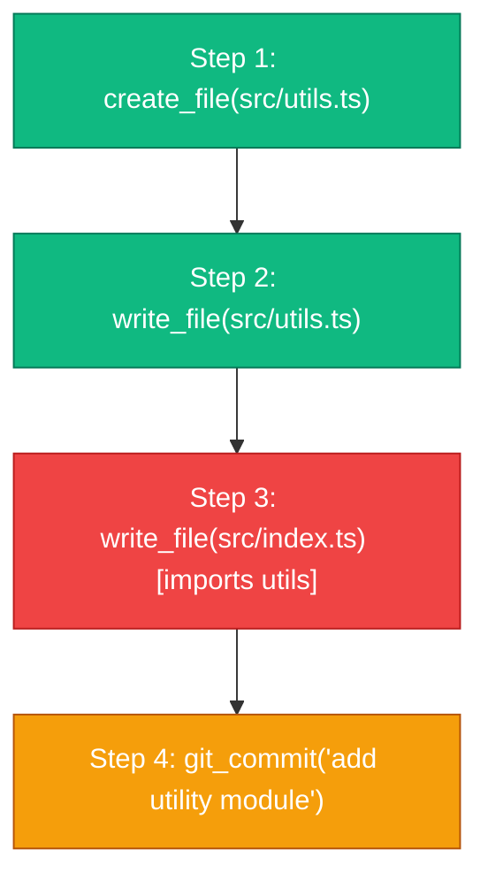
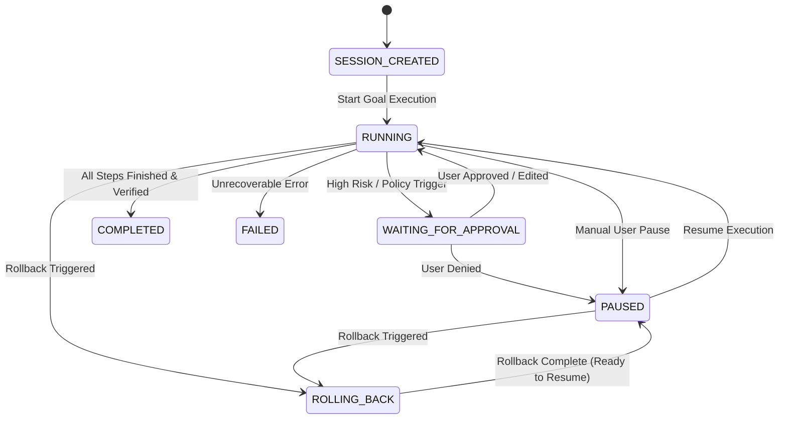
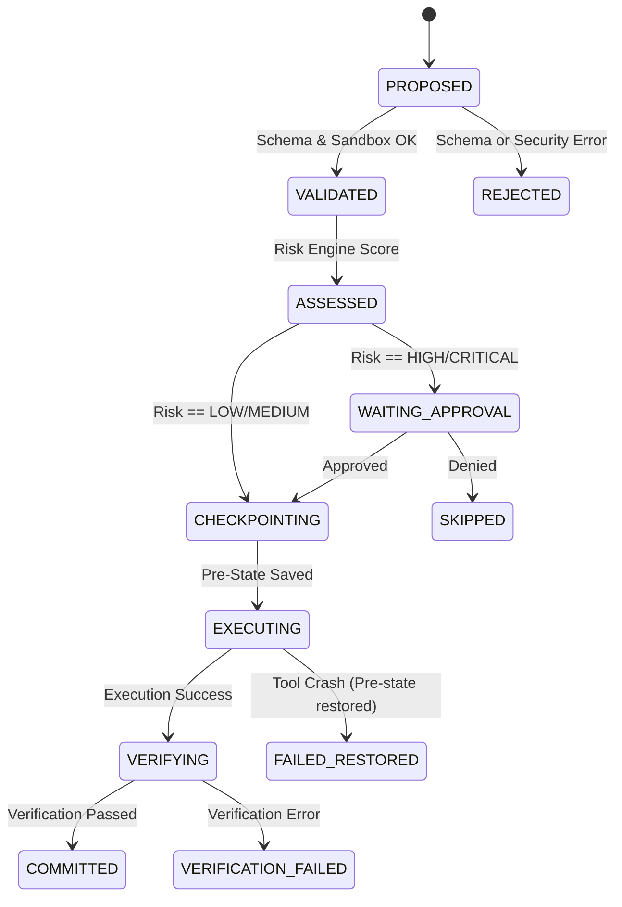

# Agent Workflow Specification — REWIND

> **Document Version**: 1.0.0 — Agent Runtime Workflow & Execution Specification  
> **Status**: Complete / Approved  
> **Event**: CUTC: Transform Hackathon 2026  
> **Repository Target**: `~/Documents/Dev/Projects/rewind`  

---

## 1. Overview

This document specifies the complete execution workflow and runtime interceptor lifecycle for autonomous AI agents within **REWIND**. 

REWIND acts as a transactional safety runtime ("Ctrl+Z for AI agents"). The core runtime isolates the LLM from executing raw side-effects against real environments. The LLM functions purely as an **untrusted planner and tool requester**, while the **REWIND Runtime** deterministically intercepts, validates, scores, snapshots, executes, verifies, records, and undoes every state-changing operation.

### 1.1 Forward Execution Lifecycle
```
[ USER INTENT ]
       │
       ▼
[ PLAN GENERATION (LLM) ]
       │
       ▼
[ ACTION PROPOSAL ] ──(Interception)──► [ SCHEMA & POLICY VALIDATION ]
                                                       │
                                                       ▼
                                            [ RISK ASSESSMENT ]
                                                       │
                           ┌───────────────────────────┴───────────────────────────┐
                           │ (If High/Critical & Requires Approval)                │
                           ▼                                                       ▼
               [ HUMAN APPROVAL GATE ] ──(Approved)──► [ PRE-STATE CHECKPOINT CAPTURE ]
                           │                                                       │
                       (Denied)                                                    ▼
                           │                                              [ SANDBOX EXECUTION ]
                           ▼                                                       │
                    [ STEP SKIPPED ]                                               ▼
                                                                        [ POST-STATE CAPTURE ]
                                                                                   │
                                                                                   ▼
                                                                         [ INVARIANT VERIFICATION ]
                                                                                   │
                                                                                   ▼
                                                                        [ INVERSE RECIPE REGISTER ]
                                                                                   │
                                                                                   ▼
                                                                        [ DAG NODE & EVENT COMMIT ]
                                                                                   │
                                                                                   ▼
                                                                           [ NEXT AGENT STEP ]
```

### 1.2 Rollback Execution Lifecycle
```
[ ROLLBACK REQUEST (User or Verification Failure) ]
       │
       ▼
[ PAUSE ACTIVE SESSION ]
       │
       ▼
[ QUERY DEPENDENCY DAG (Target Step N) ]
       │
       ▼
[ COMPUTE TOPOLOGICAL REVERSE ROLLBACK PLAN (Steps M down to N+1) ]
       │
       ▼
[ FOR EACH STEP IN REVERSE TOPOLOGICAL ORDER ]
       ├──► Check Reversibility Class & Checkpoint Availability
       ├──► Execute Pre-Action Snapshot Restoration OR Inverse Recipe Execution
       └──► Verify Intermediate State Restoration
       │
       ▼
[ RUN POST-ROLLBACK ENVIRONMENT VERIFICATION ]
       │
       ▼
[ MARK ROLLBACK COMPLETED & EMIT EVENTS ]
       │
       ▼
[ RESUME SESSION AT STEP N / AWAIT USER INPUT ]
```

---

## 2. Agent Runtime Responsibilities

REWIND establishes a strict separation of concerns between the LLM and the REWIND Runtime:

| System Domain | Component | Primary Responsibility | Reversibility Authority |
| :--- | :--- | :--- | :--- |
| **LLM (Planner)** | Language Model (OpenAI / Anthropic / Gemini / Local) | • Interpret user goal.<br>• Generate high-level step plans.<br>• Formulate candidate tool calls with arguments.<br>• Explain reasoning and intent behind actions. | **ZERO AUTHORITY**.<br>The LLM cannot execute state changes directly and is *never* asked to undo its own work. |
| **REWIND Runtime** | Interceptor, Risk Engine, Sandbox, Rollback Engine | • Intercept all tool requests.<br>• Enforce schema, security, and permission boundaries.<br>• Calculate deterministic risk scores & policies.<br>• Capture pre-action and post-action state snapshots.<br>• Execute tool calls inside isolated sandboxes.<br>• Run post-execution invariant verifications.<br>• Generate and store inverse operation recipes.<br>• Build and maintain the Action Dependency DAG.<br>• Stream live telemetry events via WebSocket.<br>• Execute 100% deterministic rollbacks without LLM calls. | **TOTAL AUTHORITY**.<br>Holds exclusive execution control, checkpoint storage, and state restoration capabilities. |

---

## 3. LLM Provider Abstraction

To ensure vendor neutrality, the REWIND agent runtime interacts with LLMs through a unified, asynchronous `LLMProvider` interface.

```
┌────────────────────────────────────────────────────────────────────────┐
│                        LLMProvider (Abstract)                          │
├────────────────────────────────────────────────────────────────────────┤
│ + generate_plan(prompt, conversation_history, tools): PlanResponse     │
│ + propose_action(step_context, active_tools): ActionProposal           │
│ + stream_reasoning(prompt, callback): void                             │
└───────────────────▲────────────────────────────────▲───────────────────┘
                    │                                │
     ┌──────────────┴──────────────┐   ┌─────────────┴──────────────┐
     │    OpenAIProvider (v1/v4)   │   │  AnthropicProvider (v3/v4) │
     └─────────────────────────────┘   └────────────────────────────┘
     ┌──────────────┬──────────────┐   ┌─────────────┬──────────────┐
     │     GeminiProvider (v1.5)   │   │   LocalOllamaProvider (v1) │
     └─────────────────────────────┘   └────────────────────────────┘
```

### 3.1 Standard Provider Data Contracts

#### Request Payload (`LLMRequest`)
```typescript
interface LLMRequest {
  sessionId: string;
  systemPrompt: string;
  messages: Array<{
    role: "system" | "user" | "assistant" | "tool";
    content: string;
    toolCallId?: string;
  }>;
  availableTools: ToolDefinition[];
  temperature: number;
  maxTokens: number;
  timeoutMs: number;
}
```

#### Response Payload (`LLMResponse`)
```typescript
interface LLMResponse {
  messageId: string;
  model: string;
  reasoningText?: string;
  toolCalls: Array<{
    toolCallId: string;
    toolName: string;
    arguments: Record<string, unknown>;
  }>;
  tokenUsage: {
    promptTokens: number;
    completionTokens: number;
    totalTokens: number;
  };
}
```

### 3.2 Resilience, Timeout, and Retry Policy
1. **Timeouts**: Every LLM API request enforces a default 30,000ms hard timeout.
2. **Retries**: Transient HTTP errors (500, 502, 503, 429) execute exponential backoff retries with jitter ($T = 2^{\text{attempt}} \times 1000\text{ms} + \text{rand}(0, 500\text{ms})$), up to 3 attempts.
3. **Structured Output Fallback**: If the LLM produces malformed JSON tool calls, the runtime rejects the tool call immediately at the Interceptor level and feeds a structured parsing error message back to the model context.

---

## 4. Structured Tool Calling Contract

Every proposed agent action must normalize into REWIND's **Canonical Action Contract** prior to risk assessment or execution.

```json
{
  "$schema": "https://json-schema.org/draft/2020-12/schema",
  "title": "CanonicalActionContract",
  "type": "object",
  "properties": {
    "action_id": { "type": "string", "format": "uuid" },
    "session_id": { "type": "string", "format": "uuid" },
    "step_index": { "type": "integer", "minimum": 1 },
    "parent_action_id": { "type": ["string", "null"], "format": "uuid" },
    "tool_name": { "type": "string" },
    "arguments": { "type": "object" },
    "reasoning": { "type": "string" },
    "risk_assessment": {
      "type": "object",
      "properties": {
        "score": { "type": "string", "enum": ["LOW", "MEDIUM", "HIGH", "CRITICAL"] },
        "rationale": { "type": "string" },
        "requires_approval": { "type": "boolean" }
      },
      "required": ["score", "rationale", "requires_approval"]
    },
    "reversibility_class": {
      "type": "string",
      "enum": ["FULLY_REVERSIBLE", "STATE_RESTORABLE", "PARTIALLY_REVERSIBLE", "IRREVERSIBLE"]
    },
    "expected_effect": { "type": "string" },
    "dependencies": {
      "type": "array",
      "items": { "type": "string", "format": "uuid" }
    }
  },
  "required": [
    "action_id",
    "session_id",
    "step_index",
    "tool_name",
    "arguments",
    "reasoning",
    "risk_assessment",
    "reversibility_class",
    "expected_effect",
    "dependencies"
  ]
}
```

---

## 5. Tool Registry & Runtime Metadata

Tools are registered within the **REWIND Tool Registry** at application startup. 

> [!IMPORTANT]
> **Runtime Authority Rule**: Tool risk classes, permissions, inverse strategies, and verification handlers are defined **exclusively by the runtime code**. The LLM cannot specify or override tool metadata.

### 5.1 Tool Declaration Structure
```typescript
interface RegisteredTool {
  name: string; // e.g. "fs.write_file"
  version: string; // e.g. "1.0.0"
  description: string;
  inputSchema: JSONSchema7; // JSON Schema for argument validation
  outputSchema: JSONSchema7;
  permissionRequired: string; // e.g. "workspace.write"
  defaultRiskClass: "LOW" | "MEDIUM" | "HIGH" | "CRITICAL";
  reversibilityClass: "FULLY_REVERSIBLE" | "STATE_RESTORABLE" | "PARTIALLY_REVERSIBLE" | "IRREVERSIBLE";
  requiresHumanApproval: boolean;
  
  // Execution & Recovery Hooks
  executeHandler: (args: Record<string, unknown>, context: ExecutionContext) => Promise<ToolResult>;
  verifyHandler: (args: Record<string, unknown>, result: ToolResult, context: ExecutionContext) => Promise<VerificationResult>;
  inverseGenerator: (args: Record<string, unknown>, preState: StateSnapshot, postState: StateSnapshot) => InverseRecipe | null;
}
```

---

## 6. Action Interceptor Pipeline

The **Action Interceptor** is the core proxy enforcing safety policy between the LLM and tool execution.

```
Proposed Tool Call
       │
       ▼
 [ Stage 1: JSON & Schema Parsing ] ──────► (Invalid JSON) ──► Rejection Event + Feed error to LLM
       │
       ▼
 [ Stage 2: Tool Registry Lookup ] ───────► (Unregistered) ──► Rejection Event + Security Flag
       │
       ▼
 [ Stage 3: Security & Sandbox Check ] ──► (Path Traversal/Root) ──► Hard Block & Security Audit Log
       │
       ▼
 [ Stage 4: Risk Engine Evaluation ] ─────► Computes LOW / MEDIUM / HIGH / CRITICAL
       │
       ▼
 [ Stage 5: Dependency Graph Analysis ] ──► Links parent action IDs & computes resource locks
       │
       ▼
 [ Stage 6: Human Approval Gate ] ────────► (If HIGH/CRITICAL) ──► Emit WAITING_FOR_APPROVAL event
       │                                                         (User selects: APPROVE/DENY/EDIT/SKIP)
       ▼
 [ Stage 7: Pre-State Snapshot ] ─────────► Git commit / File copy / Postgres SAVEPOINT
       │
       ▼
 [ Stage 8: Tool Execution ] ──────────────► Execute in isolated sandbox
       │
       ▼
 [ Stage 9: Post-State Capture ] ─────────► Compute state diff (lines, bytes, DB rows)
       │
       ▼
 [ Stage 10: Invariant Verification ] ────► Run deterministic checks (linter, syntax, test, SQL)
       │
       ▼
 [ Stage 11: Inverse Recipe Generation ] ─► Synthesize undo command/script
       │
       ▼
 [ Stage 12: Commit Action Node to DAG ] ──► Persist in PostgreSQL & Stream ACTION_COMMITTED
```

### Failure Handling during Interception Pipeline
- **Stage 1–3 Failure**: Immediate rejection before state modification; no checkpoint created.
- **Stage 8 Failure (Tool Crash)**: Pre-state snapshot immediately restored; action logged as `FAILED`.
- **Stage 10 Failure (Verification Fail)**: Triggers verification policy (warn, pause, or auto-rollback to pre-state).

---

## 7. Risk Engine Specification

REWIND utilizes a **Hybrid Risk Engine**: deterministic safety rules establish hard non-negotiable risk baselines, while LLM contextual reasoning supplies audit rationale.

```
Deterministic Safety Rules (Base Score)
                 +
Contextual Modifiers (Resource scope, file counts)
                 =
       FINAL ACTION RISK SCORE
```

### 7.1 Risk Matrix

| Risk Score | Trigger Conditions | Example Operations | Runtime Enforcement Policy |
| :--- | :--- | :--- | :--- |
| **LOW** | Read-only operations, scoped workspace queries, non-destructive file reads. | `fs.read_file`, `git.status`, `db.select` | Auto-approved; no snapshot needed; execute immediately. |
| **MEDIUM** | In-place file edits, creating new files, local git commits, isolated DB inserts. | `fs.write_file`, `git.commit`, `db.insert` | Auto-approved in Standard Mode; capture pre-state snapshot; post-verification required. |
| **HIGH** | File deletions, multi-file batch updates, schema migrations, package installs. | `fs.delete_file`, `db.alter_table`, `npm.install` | Pre-state snapshot mandatory; requires Human Approval in High-Safety mode. |
| **CRITICAL** | Destructive batch operations, raw terminal execution, external API mutations. | `shell.execute`, `http.post`, `db.drop_table` | Hard pause; **Human Approval mandatory** in all operating modes. |

---

## 8. Reversibility & Inverse Requirements

REWIND categorizes every tool action under four strict reversibility contracts:

```
                                  ┌───────────────────────────────────┐
                                  │      Reversibility Taxonomy       │
                                  └─────────────────┬─────────────────┘
                                                    │
         ┌────────────────────────┬─────────────────┴────────────────┬────────────────────────┐
         ▼                        ▼                                  ▼                        ▼
┌──────────────────┐    ┌──────────────────┐               ┌──────────────────┐    ┌──────────────────┐
│ FULLY REVERSIBLE │    │ STATE RESTORABLE │               │PARTIALLY REVERSIBLE│  │   IRREVERSIBLE   │
└────────┬─────────┘    └────────┬─────────┘               └────────┬─────────┘    └────────┬─────────┘
         │                        │                                  │                        │
         ▼                        ▼                                  ▼                        ▼
Inverse Script/Cmd        Git Commit / DB Savepoint          Cleanup Script / Reset       Audit Warning +
(e.g., delete created)    (Restores entire tree)             (e.g., npm uninstall)        Human Confirmation
```

### 8.1 Reversibility Operational Contract

1. **Fully Reversible**:
   - **Mechanism**: Exact inverse command synthesized post-execution (e.g. `fs.create_file` $\rightarrow$ `fs.delete_file`).
   - **Rollback Cost**: $\mathcal{O}(1)$ localized action reversal.
2. **State Restorable**:
   - **Mechanism**: Entire filesystem/tree or database savepoint restored to pre-action checkpoint.
   - **Rollback Cost**: Fast binary restore via Git checkout or SQL `ROLLBACK TO SAVEPOINT`.
3. **Partially Reversible**:
   - **Mechanism**: Best-effort inverse script executed (e.g. `npm install pkg` $\rightarrow$ `npm uninstall pkg`). Leaves cached artifacts.
   - **Rollback Cost**: Requires secondary environment cleanup.
4. **Irreversible**:
   - **Mechanism**: External side-effect (HTTP POST, payment charge, email dispatch). Cannot be physically undone.
   - **Rollback Policy**: Action flagged as non-restorable. Pre-execution dialog explicitly warns user. If rolled back, REWIND logs an immutable audit event noting external state divergence.

---

## 9. Checkpoint Strategy

To prevent storage explosion while guaranteeing zero data loss, REWIND enforces an **Adaptive Checkpoint Policy**.

```
Checkpoint Trigger Rules:
- Session Start: MANDATORY (Full workspace snapshot)
- Before HIGH / CRITICAL Risk Tool: MANDATORY (Git commit / DB savepoint)
- Before Reversibility Class = STATE_RESTORABLE: MANDATORY
- Periodic Milestone: Every 5 successful MEDIUM steps
- Manual User Request: MANDATORY
```

### Storage Overhead Optimization
* **Filesystem**: Uses **Git Worktree commits** on a hidden branch (`rewind/session-<id>`). Git object deduplication ensures near-zero storage penalty for unchanged files.
* **Database**: Uses PostgreSQL transaction savepoints (`SAVEPOINT rewind_step_N`) during active transactions, and lightweight row-level pre-image snapshots for committed records.

---

## 10. Execution Model & Sandboxing

Agent tools execute inside isolated runtime wrappers with enforced resource limits.

```
       [ Control Plane ]
              │
              ▼
   ┌──────────────────────┐
   │ Tool Executor Wrapper│
   └──────────┬───────────┘
              │
    ┌─────────┴─────────┐
    ▼                   ▼
[ Synchronous ]    [ Asynchronous ]
(Timeout: 10s)     (Timeout: 60s)
    │                   │
    └─────────┬─────────┘
              │
              ▼
┌───────────────────────────┐
│     Isolation Sandbox     │
│ (Jailed Path / Worktree)  │
└───────────────────────────┘
```

### 10.1 Execution Constraints
- **Path Jailing**: All file operations validate that the resolved target path lies strictly within `session.workspace_root`. Paths attempting traversal (`../`) throw a `SecurityBoundaryViolation`.
- **Timeouts**: Synchronous tools enforce a 10,000ms timeout; long-running shell/build tasks enforce a 60,000ms limit.
- **Process Isolation**: Terminal commands execute within a subshell with restricted environment variables (sensitive credentials stripped).

---

## 11. Verification Loop

Following tool execution, REWIND runs **Deterministic Invariant Verifications** before committing the step to the dependency graph.

```
Tool Execution Complete
          │
          ▼
   [ Precondition Check ] ──(Passed?)──► [ Tool Action ] ──► [ Postcondition Check ]
                                                                     │
                                                                     ▼
                                                          [ Verification Result ]
                                                                     │
                                            ┌────────────────────────┴────────────────────────┐
                                            ▼                                                 ▼
                                    [ PASSED ]                                        [ FAILED ]
                                            │                                                 │
                                            ▼                                                 ▼
                                  [ Commit Action ]                                 [ Verification Policy ]
                                                                                    (Warn / Pause / Revert)
```

### 11.1 Verification Policy Matrix

| Outcome | Meaning | Action Taken |
| :--- | :--- | :--- |
| **Tool Succeeded & Verification Passed** | Action executed correctly; environment invariant satisfied. | Action committed to DAG; session advances. |
| **Tool Succeeded but Verification Failed** | Code edited, but syntax error or test break introduced. | Action logged with `VERIFICATION_FAILED` status. Execution paused. User prompted: **1) Auto-Rollback Step**, **2) Allow Agent to Fix**, **3) Override**. |
| **Tool Execution Failed** | Tool threw runtime error (e.g. File Not Found). | Pre-state snapshot restored; error returned to LLM context. |

---

## 12. Action Dependency Graph (DAG)

REWIND represents agent execution as a Directed Acyclic Graph $G = (V, E)$, where $V$ are Action Log nodes and $E$ represent causal state dependencies.



### 12.1 Rollback Propagation Policy
If the user requests a rollback to **Step 2**, REWIND performs a **Topological Reverse Traversal**:
1. Identify target node $N$ (Step 2).
2. Compute descendant subtree $\text{Descendants}(N) = \{\text{Step 3}, \text{Step 4}\}$.
3. Execute rollbacks in reverse topological order: **Step 4** $\rightarrow$ **Step 3** $\rightarrow$ **Step 2 restoration**.
4. Guarantee no orphan file dependencies or broken cross-file imports remain in the restored state.

---

## 13. Canonical Event Stream Specification

REWIND streams high-granularity JSON events over WebSockets (`WS /api/v1/sessions/{id}/stream`) to update the frontend Time Machine UI in real time.

```
WebSocket Telemetry Topics:
- session.status (STARTED, PAUSED, COMPLETED, FAILED)
- action.lifecycle (PROPOSED, ASSESSED, STARTED, COMPLETED, COMMITTED)
- checkpoint.created (SNAPSHOT_ID, HASH, SIZE)
- verification.result (PASSED, FAILED, ERRORS)
- rollback.lifecycle (REQUESTED, STARTED, STEP_REVERTED, COMPLETED)
```

### 13.1 Key Event Payload Definitions

#### `ACTION_PROPOSED`
```json
{
  "event_type": "ACTION_PROPOSED",
  "session_id": "9b1deb4d-3b7d-4bad-9bdd-2b0d7b3dcb6d",
  "timestamp": "2026-08-15T14:00:00.100Z",
  "payload": {
    "action_id": "a0123456-7890-abcd-ef01-234567890abc",
    "step_index": 3,
    "tool_name": "fs.write_file",
    "arguments": { "path": "src/app.ts", "content": "console.log('init');" },
    "reasoning": "Adding application entry point logging."
  }
}
```

#### `RISK_ASSESSED`
```json
{
  "event_type": "RISK_ASSESSED",
  "session_id": "9b1deb4d-3b7d-4bad-9bdd-2b0d7b3dcb6d",
  "timestamp": "2026-08-15T14:00:00.150Z",
  "payload": {
    "action_id": "a0123456-7890-abcd-ef01-234567890abc",
    "risk_score": "MEDIUM",
    "reversibility_class": "FULLY_REVERSIBLE",
    "requires_approval": false
  }
}
```

#### `ROLLBACK_COMPLETED`
```json
{
  "event_type": "ROLLBACK_COMPLETED",
  "session_id": "9b1deb4d-3b7d-4bad-9bdd-2b0d7b3dcb6d",
  "timestamp": "2026-08-15T14:05:00.000Z",
  "payload": {
    "target_step_index": 2,
    "reverted_action_ids": ["a0123456-7890-abcd-ef01-234567890abc"],
    "restored_checkpoint_id": "chk_987654321",
    "status": "SUCCESS"
  }
}
```

---

## 14. Human Approval Gateway

When an action is evaluated as **HIGH** or **CRITICAL** risk (or violates safety heuristics), execution halts and the runtime enters `WAITING_FOR_APPROVAL`.

```
                  ┌──────────────────────────────┐
                  │ WAITING_FOR_APPROVAL State   │
                  └──────────────┬───────────────┘
                                 │
         ┌───────────────────────┼───────────────────────┬───────────────────────┐
         ▼                       ▼                       ▼                       ▼
    [ APPROVE ]               [ DENY ]                [ EDIT ]                [ SKIP ]
         │                       │                       │                       │
         ▼                       ▼                       ▼                       ▼
Execute action &       Abort step & notify    Modify tool arguments   Bypass step & move
capture snapshot       LLM context            & re-run Interceptor    to next plan step
```

---

## 15. Failure Mode & Recovery Taxonomy

| Failure Scenario | Root Cause | Runtime Recovery Behavior | Safety Outcome |
| :--- | :--- | :--- | :--- |
| **Malformed LLM Output** | Invalid JSON or tool name hallucination. | Interceptor rejects tool call; returns structured schema error to LLM context. | No environment side-effects executed. |
| **Path Traversal Attempt** | LLM requests `fs.write_file("../../../etc/passwd")`. | Interceptor triggers `SecurityBoundaryViolation`; hard blocks execution; logs security audit. | Jailed workspace strictly preserved. |
| **Tool Execution Crash** | Syntax error in script, missing command, file lock. | Interceptor catches exception; executes immediate restore to pre-action checkpoint. | Workspace returned to clean state. |
| **Verification Failure** | Action succeeded, but linter or unit tests fail. | Runtime logs `VERIFICATION_FAILED`; pauses session; prompts user for fix vs rollback. | Flawed state isolated before proceeding. |
| **Rollback Execution Error** | File lock or disk permission error during rollback. | Rollback Engine halts; marks session `ROLLBACK_FAILED`; triggers fallback Git hard checkout. | Emergency fallback state restoration. |

---

## 16. LLM Hallucination Defense Model

REWIND operates on a **Zero-Trust LLM Architecture**. The runtime assumes the LLM is an untrusted entity that will periodically hallucinate.

```
                           LLM PROPOSAL
                                │
                                ▼
         ┌──────────────────────────────────────────────┐
         │         REWIND Defense Interceptors          │
         ├──────────────────────────────────────────────┤
         │ 1. Schema Validation (Rejects invalid params)│
         │ 2. Resource Existence Verification           │
         │ 3. Workspace Path Jailing                    │
         │ 4. Deterministic Risk Classification          │
         └──────────────────────┬───────────────────────┘
                                │
                                ▼
                       VALIDATED RUNTIME TOOL
```

1. **Hallucinated File Paths**: Target files are validated against the actual filesystem before execution. If a tool references a non-existent file for editing, the runtime rejects the action.
2. **Hallucinated Rollback Requests**: The LLM is **never** permitted to issue rollback commands. Rollback is triggered exclusively by human users via the UI or by automated verification assertions.

---

## 17. Session Lifecycle State Machine



---

## 18. Concurrency & Action Execution Order

For the hackathon MVP, REWIND enforces **Strict Sequential Execution** of agent tool calls ($\text{Step}_1 \rightarrow \text{Step}_2 \rightarrow \dots \rightarrow \text{Step}_n$).

* **Rationale**: Sequential execution eliminates race conditions in file modification, guarantees deterministic Git tree commits, and simplifies Action Dependency DAG generation.
* **Future Parallelism**: Independent read-only tools (`fs.read_file`, `grep_search`) may execute in parallel in post-MVP releases.

---

## 19. Observability, Telemetry & Secret Redaction

1. **Structured Logging**: All runtime components log JSON structured logs tagged with `session_id`, `action_id`, and `step_index`.
2. **Secret Redaction**: Pre-execution filters scan all tool inputs and outputs for API key patterns (`sk-...`, `ghp_...`, `Bearer ...`, DB passwords). Matched secrets are replaced with `[REDACTED_SECRET]` before persistence or WebSocket streaming.
3. **Metrics Tracking**:
   * Action Interception Latency ($t_{\text{intercept}} < 5\text{ms}$).
   * Checkpoint Creation Time ($t_{\text{snapshot}} < 50\text{ms}$).
   * Rollback Restoration Speed ($t_{\text{rollback}} < 500\text{ms}$).

---

## 20. Security Boundary & Trust Hierarchy

```
                      ┌────────────────────────┐
                      │    HUMAN OPERATOR      │ (Ultimate Authority)
                      └───────────┬────────────┘
                                  │
                                  ▼
                      ┌────────────────────────┐
                      │  REWIND CONTROL PLANE  │ (Enforces Security Policy)
                      └───────────┬────────────┘
                                  │
                                  ▼
                      ┌────────────────────────┐
                      │   RUNTIME SANDBOX      │ (Jailed FS / Git / DB Savepoint)
                      └───────────┬────────────┘
                                  │
                                  ▼
                      ┌────────────────────────┐
                      │    UNTRUSTED LLM       │ (Proposal Generator Only)
                      └────────────────────────┘
```

---

## 21. Concrete End-to-End Workflow Example

### Scenario: Refactoring Legacy Configuration Code
**User Goal**: *"Update database config in `src/config.ts` and remove deprecated `config.old.json`."*

```
1. LLM proposes Step 1: fs.write_file("src/config.ts", "<updated ts content>")
   ├── Interceptor parses JSON schema -> VALID
   ├── Risk Engine evaluates -> MEDIUM (File Edit)
   ├── Pre-State Capture -> Git snapshot created (Commit hash: a1b2c3d)
   ├── Tool Execution -> File written to disk
   ├── Post-State Capture -> Diff computed (+15 lines, -5 lines)
   ├── Verification -> Runs `npx tsc --noEmit` -> PASSED
   └── Action committed to DAG (Action ID: A1)

2. LLM proposes Step 2: fs.delete_file("config.old.json")
   ├── Interceptor parses JSON schema -> VALID
   ├── Risk Engine evaluates -> HIGH (File Deletion)
   ├── Human Approval Gate -> UI displays approval prompt -> User clicks APPROVE
   ├── Pre-State Capture -> Pre-image copy of config.old.json saved
   ├── Tool Execution -> File deleted
   ├── Verification -> Checks file non-existence -> PASSED
   └── Action committed to DAG (Action ID: A2)

3. LLM proposes Step 3: fs.write_file("src/app.ts", "import { db } from './config.old';")
   ├── Tool Execution -> File updated
   ├── Verification -> Runs `npx tsc --noEmit` -> FAILED (Cannot find module './config.old')
   └── Runtime logs VERIFICATION_FAILED event & pauses session

4. User presses Ctrl+Z (Rollback to Step 1):
   ├── Rollback Engine identifies target (Step 1)
   ├── DAG computes reverse path: Revert Step 3 -> Revert Step 2
   ├── Inverse Executions:
   │   ├── Revert Step 3: Restore src/app.ts pre-state
   │   └── Revert Step 2: Re-create config.old.json from pre-image snapshot
   ├── Environment verification runs (`npx tsc`) -> PASSED
   └── Session state restored to Step 1; UI scrub bar moves back to Step 1.
```

---

## 22. Detailed State Machine Diagrams

### Action Interceptor Lifecycle State Machine


---

## 23. Core Component Pseudocode

### 23.1 Action Interceptor Pipeline Pseudocode
```python
async def intercept_and_execute_action(session_id: str, proposed_call: Dict[str, Any]) -> ActionResult:
    # 1. Parse & Validate Schema
    tool = tool_registry.get(proposed_call["tool_name"])
    if not tool:
        raise SecurityException(f"Unregistered tool: {proposed_call['tool_name']}")
    
    validated_args = tool.input_schema.validate(proposed_call["arguments"])
    
    # 2. Risk Assessment
    risk_assessment = risk_engine.evaluate(tool, validated_args, session_context)
    
    # 3. Human Approval Gate
    if risk_assessment.requires_approval:
        approval_status = await event_bus.wait_for_user_approval(session_id, proposed_call)
        if approval_status == ApprovalStatus.DENIED:
            return ActionResult(status="SKIPPED", reason="User denied action")
            
    # 4. Capture Pre-State Snapshot
    snapshot_id = await checkpoint_manager.capture_pre_state(
        session_id=session_id,
        reversibility_class=tool.reversibility_class,
        target_resources=tool.get_affected_resources(validated_args)
    )
    
    # 5. Execute Tool in Sandbox
    try:
        execution_result = await sandbox.execute(tool.handler, validated_args)
    except Exception as err:
        await checkpoint_manager.restore_snapshot(snapshot_id)
        return ActionResult(status="FAILED", error=str(err))
        
    # 6. Post-State Capture & Inverse Recipe Generation
    post_snapshot = await checkpoint_manager.capture_post_state(session_id)
    inverse_recipe = tool.generate_inverse(validated_args, snapshot_id, post_snapshot)
    
    # 7. Verification Loop
    verification = await tool.verify(validated_args, execution_result)
    
    # 8. Commit to DAG & Emit Events
    action_node = dag_manager.commit_action(
        session_id=session_id,
        tool=tool.name,
        args=validated_args,
        pre_snapshot=snapshot_id,
        inverse_recipe=inverse_recipe,
        verification=verification
    )
    await websocket_stream.emit("ACTION_COMMITTED", action_node.to_dict())
    
    return ActionResult(status="COMMITTED", action_id=action_node.id)
```

---

## 24. API & Database Interaction Boundaries

The Agent Runtime requires explicit contracts from surrounding REWIND subsystems:

* **Control Plane API (`docs/API.md`)**: Consumes session creation, WebSocket stream dispatcher, and user approval response endpoints.
* **Database Layer (`docs/DATABASE.md`)**: Reads and writes relational entities defined in `docs/DATA_MODEL.md` (`sessions`, `action_logs`, `checkpoints`, `action_dependencies`, `inverse_operations`).
* **Rollback Engine (`docs/ROLLBACK_ENGINE.md`)**: Invokes reverse topological traversal and snapshot restoration routines during rollback requests.

---

## 25. Hackathon MVP Implementation Scope

For the hackathon demo, REWIND will focus strictly on the following subset of runtime tools:

1. **Filesystem Tools**: `fs.write_file`, `fs.create_file`, `fs.delete_file`, `fs.read_file`.
2. **Git Tools**: `git.commit`, `git.checkout_worktree`, `git.status`.
3. **Database Tools**: `db.execute_sql`, `db.rollback_savepoint`.
4. **Verification Engines**: Deterministic syntax validation (`python -m py_compile`, `tsc --noEmit`), file existence checks, and SQL dry-run verification.
5. **WebSocket Telemetry**: Streaming live JSON action logs, risk scores, visual state diffs, and rollback notifications.

---

## 26. Testability & Component Isolations

Every component within the agent runtime must be testable in isolation:

* **Tool Registry Unit Tests**: Validate schema parsing and runtime metadata immutability.
* **Interceptor Unit Tests**: Mock LLM proposals and verify that unauthorized file path traversals are blocked.
* **Risk Engine Unit Tests**: Assert correct risk tier output across combinations of tool types and target file counts.
* **Rollback Integration Tests**: Execute 5-step synthetic file modification plans, trigger rollback to Step 2, and assert 100% file content equality against pre-execution MD5 hashes.

---

## 27. Open Technical Questions

1. **Large Binary Checkpointing**: What is the performance impact of capturing Git snapshots when workspace directories contain large node_modules or binary assets? *(Mitigation: Default `.gitignore` exclusions strictly enforced in sandboxes).*
2. **Long-Running Process Interception**: How should REWIND manage inverse recipes for tools that spawn persistent background daemons? *(Mitigation: Scoped to MVP tools which exclude background daemons).*
