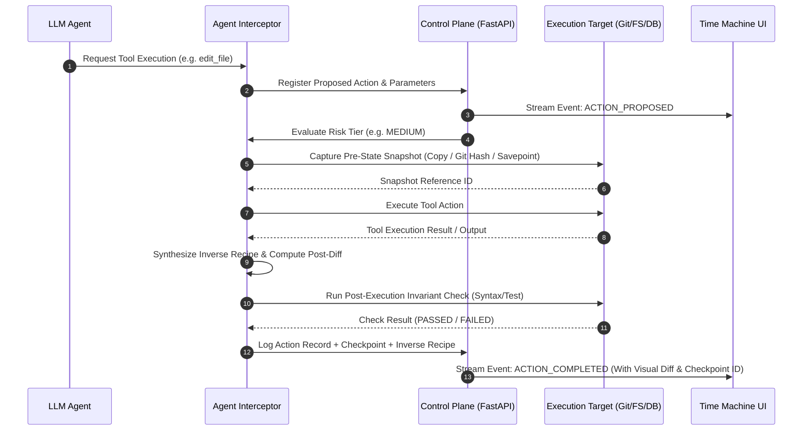
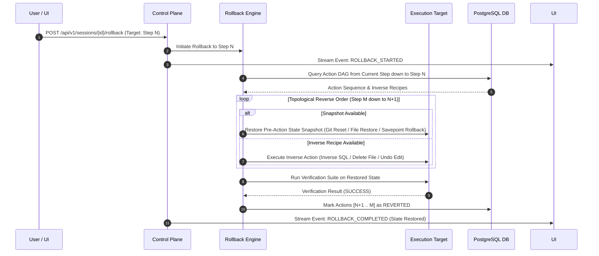

# System Architecture Specification — REWIND

> **Document Version**: 1.0.0 — System Architecture Freeze  
> **Status**: Complete / Approved  
> **Event**: CUTC: Transform Hackathon 2026  
> **Repository Target**: `~/Documents/Dev/Projects/rewind`  

---

## 1. Executive System Summary

**REWIND** is a transactional execution runtime and safety control plane for autonomous AI agents. It operates as a deterministic proxy layer sitting between an LLM agent framework (e.g. LangChain, AutoGen, CrewAI, or custom OpenAI/Anthropic/Gemini tool-calling loops) and the execution environment (Filesystem, Git workspace, PostgreSQL database, shell/CLI).

### Fundamental Architectural Thesis
1. **LLM Non-Determinism vs. Runtime Determinism**: The LLM acts strictly as a **planner and tool requester**. The REWIND runtime acts as an **authoritative state proxy**, responsible for intercepting tool requests, pre-action state checkpointing, risk classification, executing operations within sandboxed boundaries, post-execution invariant verification, recording action provenance, and executing deterministic rollbacks.
2. **LLM-Independent Rollbacks**: Rollback operations are strictly deterministic. REWIND never prompts an LLM to "undo what you did." All rollbacks execute via pre-recorded binary/text state snapshots, Git tree restorations, DB savepoints, and inverse operation execution graphs.

---

## 2. High-Level Architecture & Component Map

```
                               ┌──────────────────────────────────────────────┐
                               │           Next.js 14+ Frontend              │
                               │             (Time Machine UI)                │
                               └──────────────────────┬───────────────────────┘
                                                      │  REST API / Bi-directional
                                                      │  WebSocket Stream
                                                      ▼
┌────────────────────────────────────────────────────────────────────────────────────────────────────────┐
│                                   FastAPI Backend Control Plane                                        │
│  ┌───────────────────────────┐  ┌─────────────────────────────┐  ┌──────────────────────────────────┐  │
│  │   Session & DAG Manager   │  │  State Checkpoint Engine   │  │   Risk Analysis & Verification   │  │
│  └───────────────────────────┘  └─────────────────────────────┘  └──────────────────────────────────┘  │
└─────────────────────────────────────────────┬──────────────────────────────────────────────────────────┘
                                              │ Interception / Snapshot API
                                              ▼
┌────────────────────────────────────────────────────────────────────────────────────────────────────────┐
│                                     Agent Interceptor & Sandbox                                        │
│  ┌───────────────────────────┐  ┌─────────────────────────────┐  ┌──────────────────────────────────┐  │
│  │   LLM Tool Interceptor    │  │  Inverse Recipe Generator   │  │  Workspace Isolation (Git/Docker)│  │
│  └───────────────────────────┘  └─────────────────────────────┘  └──────────────────────────────────┘  │
└──────────────────────┬──────────────────────────────────────────────────────────────┬──────────────────┘
                       │                                                              │
                       ▼                                                              ▼
┌───────────────────────────────────────────┐                  ┌─────────────────────────────────────────┐
│        Managed Execution Target           │                  │               Persistence               │
│ (Filesystem, Git Worktree, Postgres DB)   │                  │             (PostgreSQL DB)             │
└───────────────────────────────────────────┘                  └─────────────────────────────────────────┘
```

---

## 3. Core Subsystems & Responsibilities

### 3.1 Next.js 14+ Time Machine Frontend (`/frontend`)
- **Interactive Scrubber & Timeline**: Displays chronological and DAG-branched history of agent tool actions with status (SUCCESS, FAILED, REVERTED, PENDING), execution time, and risk tier badges.
- **Visual State Diff Inspector**: Monaco-editor powered visual diff engine displaying precise line-by-line file changes, Git commit deltas, and DB record changes per action step.
- **Control Interface**: Provides manual controls to Pause Agent Execution, Single-Step Advance, Trigger Ctrl+Z Rollback to any past checkpoint, and inspect Action Provenance.
- **Real-Time Streaming**: Consumes WebSocket events for instant state updates without page reloads.

### 3.2 FastAPI Backend Control Plane (`/backend`)
- **Session Lifecycle Orchestrator**: Initializes agent execution contexts, manages environment isolated directories, and tracks active agent runs.
- **DAG Execution Engine**: Computes directional action dependencies ($G = (V, E)$ where $V$ are action log nodes and $E$ are state dependencies), allowing downstream dependency resolution during selective rollbacks.
- **Checkpoint & Snapshot Registry**: Manages snapshot lifecycle, linking state diff hashes to database records and disk storage.
- **Rest API & WebSocket Gateway**: Serves endpoints for UI interactions and streams JSON telemetry events (`ACTION_PROPOSED`, `CHECKPOINT_CREATED`, `ACTION_EXECUTED`, `VERIFICATION_PASSED`, `ROLLBACK_STARTED`, `ROLLBACK_COMPLETED`).

### 3.3 Agent Interceptor & Runtime Layer (`/agent`)
- **Tool Interceptor Protocol**: Wraps standard agent tools (`write_file`, `edit_file`, `execute_bash`, `run_sql`, `git_commit`, `http_request`). Intercepts every tool call request before execution.
- **Pre-Execution Snapshot Engine**: Takes lightweight, zero-copy snapshots of affected files/tables prior to tool execution.
- **Risk Assessor**: Evaluates tool parameters against safety policies (LOW, MEDIUM, HIGH, DESTRUCTIVE).
- **Inverse Operation Generator**: Synthesizes structured inverse operations for reversible tools (e.g. `delete_file` -> restore pre-state file; `create_file` -> `rm_file`; `UPDATE table` -> execute reverse `UPDATE` from pre-image data).
- **Invariant Verifier**: Executes automated syntax/linter checks, test suite passes, or DB integrity assertions post-execution.

### 3.4 Managed Execution Target & Isolation Layer (`/infra` & Sandbox)
- **Git Worktree / Directory Jail**: Executes all file tool operations in an isolated Git worktree or jailed target directory.
- **PostgreSQL Savepoint Engine**: Uses transaction savepoints (`SAVEPOINT rewind_step_N`) for database tool execution sandboxing.
- **Docker Container Sandbox (Optional/Advanced)**: Containerized sandbox for arbitrary bash command execution.

### 3.5 Persistence Layer (`/backend/db`)
- PostgreSQL database storing relational tables for `sessions`, `action_logs`, `checkpoints`, `action_dependencies`, `inverse_operations`, and `verifications`.

---

## 4. Reversibility & Action Classification Matrix

REWIND categorizes every tool call into one of four explicit operational classes to guarantee honest state management:

| Reversibility Class | Tool Examples | Snapshot / Rollback Strategy | Risk Rating |
| :--- | :--- | :--- | :--- |
| **Fully Reversible (State-Restorable)** | `write_file`, `edit_file`, `create_file`, `delete_file`, `git_commit`, `db_insert`, `db_update`, `db_delete` | **Snapshot & Inverse Operation**: Pre-execution file copy / Git stash / DB transaction savepoint. Reverted deterministically by restoring exact pre-state or applying inverse SQL. | **LOW / MEDIUM** |
| **Partially Reversible** | `npm install`, `pip install`, `make build`, service start/stop | **Inverse Script + Environment Clean**: Execute package uninstall or process termination. Cached build artifacts cleaned via workspace reset. | **MEDIUM** |
| **Non-Reversible / External Side-Effect** | `http_post`, `send_email`, `stripe_charge`, `post_webhook`, `cloud_deploy` | **Audit Logging + Pre-Execution Warning**: Cannot be undone physically. REWIND flags action as irreversible, logs immutable audit entry, and optionally requires human confirmation. | **HIGH / DESTRUCTIVE** |
| **Read-Only / Side-Effect Free** | `read_file`, `list_dir`, `grep_search`, `db_select`, `git_status` | **No Rollback Required**: Logged for DAG dependency analysis and provenance tracing; no state snapshot needed. | **LOW** |

---

## 5. End-to-End Action Interception & Execution Sequence



---

## 6. Rollback Engine Architecture



---

## 7. Key Technical Decisions (ADR References)

- **ADR-001**: Modular repository structure (`docs/`, `backend/`, `frontend/`, `agent/`, `infra/`, `tests/`).
- **ADR-002**: Bi-directional WebSockets for real-time live telemetry streaming and manual execution pause/rewind control.
- **ADR-003**: Git worktree and Postgres savepoint isolation for zero-overhead, 100% accurate state snapshots.
- **ADR-004**: Hybrid Rollback strategy combining deterministic state snapshots with topological inverse action execution along the action dependency DAG.

---

## 8. Data Persistence Architecture Overview

### Relational Schema Summary
- `sessions`: Tracks session ID, goal prompt, target workspace path, status, created_at.
- `action_logs`: Tracks action ID, session ID, step index, tool name, tool input (JSON), tool output (JSON), status, risk score, reversibility class, created_at.
- `checkpoints`: Tracks checkpoint ID, session ID, step index, snapshot type (GIT_COMMIT, FILE_TREE, DB_SAVEPOINT), state hash, snapshot payload path.
- `action_dependencies`: Maps dependency edges (`parent_action_id`, `child_action_id`, `dependency_type`).
- `inverse_operations`: Stores inverse recipe JSON (`inverse_tool_name`, `inverse_parameters`).
- `verifications`: Stores test/linter verification results (`action_id`, `verification_type`, `passed`, `output`).

---

## 9. Security & Sandboxing Boundaries

1. **Jailed Directory Boundary**: File tools restricted strictly to sub-paths within `target_workspace_path`. Traversal (`../`) rejected.
2. **Command Interception**: Danger-listed bash commands (`rm -rf /`, `dd`, `mkfs`, `sudo`, raw socket connections) blocked by interceptor.
3. **Non-Reversible Audit Locks**: Any tool tagged `NON_REVERSIBLE` generates a mandatory prompt or explicit UI confirmation requirement when in High-Safety mode.
