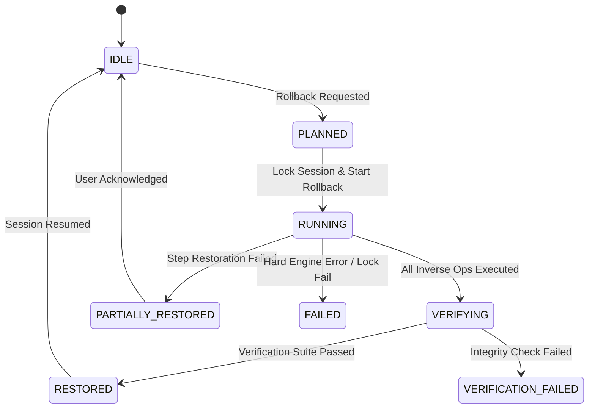

# Rollback Engine Specification — REWIND

> **Document Version**: 1.0.0 — Rollback Engine Technical Specification  
> **Status**: Complete / Approved  
> **Event**: CUTC: Transform Hackathon 2026  
> **Repository Target**: `~/Documents/Dev/Projects/rewind`  

---

## 1. Rollback Engine Overview

The **Rollback Engine** is the core transactional component of REWIND. It provides single-action, checkpoint, and multi-step state restoration ("Ctrl+Z") for autonomous AI agents across filesystems, Git worktrees, and relational databases.

> [!IMPORTANT]
> **Deterministic Non-LLM Principle**: Rollback is executed **100% deterministically** by software engines (Git tree restores, pre-image file copies, database savepoints/inverse SQL). **The LLM is never invoked during rollback** and is never asked to generate an "undo" plan.

### 1.1 Core Responsibilities & System Boundaries

```
┌────────────────────────────────────────────────────────────────────────────────────────┐
│                                   REWIND CONTROL PLANE                                 │
└───────────────────────────────────────────┬────────────────────────────────────────────┘
                                            │ Invokes Rollback(target_id)
                                            ▼
┌────────────────────────────────────────────────────────────────────────────────────────┐
│                                    ROLLBACK ENGINE                                     │
│  ┌─────────────────────────────┐ ┌───────────────────────────┐ ┌────────────────────┐  │
│  │   Rollback Planner & DAG    │ │ Domain Restoration Drivers│ │  Rollback Verifier │  │
│  │  Topological Reverse Order  │ │ (FS / Git / PostgreSQL)   │ │  Invariant Checks  │  │
│  └─────────────────────────────┘ └───────────────────────────┘ └────────────────────┘  │
└──────┬────────────────────────────────────┬────────────────────────────────────┬───────┘
       │ Reads Metadata                     │ Restores State                     │ Verifies
       ▼                                    ▼                                    ▼
┌───────────────┐                  ┌──────────────────┐                 ┌──────────────────┐
│  State Store  │                  │ Target Sandbox   │                 │   Verification   │
│(Action Logs,  │                  │  (Filesystem /   │                 │      Engine      │
│ Checkpoints)  │                  │  Git / Postgres) │                 │  (Linter / Test) │
└───────────────┘                  └──────────────────┘                 └──────────────────┘
```

#### What the Rollback Engine OWNS:
* Resolution of target step dependencies via the Action Dependency DAG.
* Construction of deterministic, reverse-topological Rollback Plans.
* Orchestration of multi-domain state restoration (Filesystem, Git Worktrees, PostgreSQL).
* Execution of inverse action recipes and checkpoint snapshot restorations.
* Post-rollback environment invariant verification.
* Emission of structured rollback telemetry events over WebSockets.

#### What the Rollback Engine DOES NOT OWN:
* LLM context management or prompt generation (owned by `Agent Runtime`).
* Initial tool call risk evaluation or execution (owned by `Action Interceptor`).
* Database DDL schema migrations (owned by `Database Migration Layer`).

---

## 2. Rollback Strategies

REWIND implements three distinct state restoration strategies:

```
                                  ┌──────────────────────────────────┐
                                  │   Engine Rollback Strategies     │
                                  └─────────────────┬────────────────┘
                                                    │
         ┌──────────────────────────────────────────┼──────────────────────────────────────────┐
         ▼                                          ▼                                          ▼
┌──────────────────────────────────┐    ┌──────────────────────────────────┐    ┌──────────────────────────────────┐
│ A. INVERSE OPERATION ROLLBACK    │    │ B. SNAPSHOT RESTORATION ROLLBACK │    │ C. HYBRID ROLLBACK (RECOMMENDED) │
├──────────────────────────────────┤    ├──────────────────────────────────┤    ├──────────────────────────────────┤
│ Executes discrete inverse recipe │    │ Restores entire workspace state  │    │ Combines selective inverse ops   │
│ for isolated action steps.       │    │ from pre-recorded checkpoint.    │    │ with milestone snapshot restores │
│ e.g., create_file -> delete_file │    │ e.g., git checkout worktree      │    │ for multi-domain targets.        │
└──────────────────────────────────┘    └──────────────────────────────────┘    └──────────────────────────────────┘
```

### Strategy Selection Heuristic
1. **Single Step Undo**: Prefers **Strategy A (Inverse Operation)** if an inverse recipe exists and affected resources have zero downstream dependencies.
2. **Multi-Step / Checkpoint Rewind**: Prefers **Strategy B (Snapshot Restoration)** for Git and Filesystem resources to guarantee 100% state fidelity in $\mathcal{O}(1)$ time.
3. **Cross-Domain Session Rewind**: Executes **Strategy C (Hybrid Rollback)**: Git Worktrees restore files, inverse pre-image SQL restores committed DB rows, and external side-effects log audit warnings.

---

## 3. Reversibility Contract

Every tool action logged in REWIND adheres to one of four canonical reversibility classes:

| Reversibility Class | Meaning | Pre-Requirement | Inverse Capability | User Approval Gate | Failure Behavior |
| :--- | :--- | :--- | :--- | :--- | :--- |
| `FULLY_REVERSIBLE` | Exact deterministic inverse operation exists. | Target path / entity pre-state reference. | Complete inverse recipe execution. | Auto-approved in Standard Mode. | Reverts cleanly; falls back to snapshot if inverse fails. |
| `STATE_RESTORABLE` | Workspace state restorable via Git commit or DB savepoint. | Pre-action Git commit hash / Postgres SAVEPOINT. | Git worktree checkout / DB savepoint rollback. | Auto-approved in Standard Mode. | Restores exact snapshot state; wipes uncommitted deltas. |
| `PARTIALLY_REVERSIBLE` | Environment modifications can be cleaned, but caches/logs remain. | Pre-action dependency state log. | Execute cleanup script (e.g. `npm uninstall`). | Requires approval in High-Safety mode. | Leaves audit log of residual cached artifacts. |
| `IRREVERSIBLE` | Action mutates external state (HTTP POST, Payment, Email). | Immutable audit log entry pre-execution. | **NONE**. External side-effect cannot be physically undone. | **Mandatory Approval Required** in all modes. | Restores local state; logs `IRREVERSIBLE_ACTION_WARNING`. |

---

## 4. Action History Data Model

The Rollback Engine requires every recorded action log node to provide a complete provenance record:

```typescript
interface RollbackActionNode {
  actionId: string;                 // UUID v4
  sessionId: string;                // UUID v4
  stepIndex: number;                // 1-indexed execution step
  timestamp: string;                // ISO-8601 UTC timestamp
  toolName: string;                 // Canonical tool identifier (e.g. "fs.write_file")
  arguments: Record<string, any>;   // JSON tool inputs
  preStateRef: {
    gitCommitHash?: string;
    filePreImageHash?: string;
    dbSavepointName?: string;
  };
  postStateRef: {
    gitCommitHash?: string;
    filePostImageHash?: string;
    affectedPaths: string[];
  };
  checkpointId?: string;            // Reference to associated Checkpoint record
  reversibilityClass: "FULLY_REVERSIBLE" | "STATE_RESTORABLE" | "PARTIALLY_REVERSIBLE" | "IRREVERSIBLE";
  inverseRecipe: {
    toolName: string;
    arguments: Record<string, any>;
  } | null;
  dependencies: string[];           // Parent action IDs
  verificationResult: "PASSED" | "FAILED" | "SKIPPED";
  status: "COMMITTED" | "REVERTED" | "FAILED";
}
```

---

## 5. Action Dependency Graph (DAG)

REWIND builds a Directed Acyclic Graph $G = (V, E)$ during forward execution:
* **Vertices ($V$)**: Immutable Action Log nodes.
* **Edges ($E$)**: Directional dependencies $(u, v)$ where action $v$ depends on state created by action $u$.

```
           ┌─────────────────────────────────────────┐
           │ Step 1: fs.create_file("src/config.ts") │ (Action A)
           └────────────────────┬────────────────────┘
                                │
                                ▼
           ┌─────────────────────────────────────────┐
           │ Step 2: fs.write_file("src/config.ts")  │ (Action B)
           └────────────────────┬────────────────────┘
                                │
         ┌──────────────────────┴──────────────────────┐
         ▼                                             ▼
┌─────────────────────────────────────────┐   ┌─────────────────────────────────────────┐
│ Step 3: fs.write_file("src/index.ts")   │   │ Step 4: db.execute_sql("INSERT INTO...")│
│ (Imports src/config.ts)                 │   │ (References config ID)                  │
└────────────────────┬────────────────────┘   └────────────────────┬────────────────────┘
                     │                                             │
                     └──────────────────────┬──────────────────────┘
                                            ▼
                       ┌─────────────────────────────────────────┐
                       │ Step 5: git.commit("Add config module") │
                       └─────────────────────────────────────────┘
```

### 5.1 Dependency Types & Traversal Rules
1. **Causal Dependency**: Action $B$ explicitly references outputs or resources created by Action $A$.
2. **Resource Dependency**: Action $B$ mutates the exact file path or database table previously touched by Action $A$.
3. **State Dependency**: Action $B$ occurred chronologically after a milestone checkpoint dependent on Action $A$.
4. **Downstream Resolution Rule**: When target action $A$ is selected for rollback, the Rollback Engine computes the transitive closure $\text{Descendants}(A)$ and includes all child nodes in the rollback plan to prevent orphan dependencies.

---

## 6. Rollback Targets & Scope

REWIND supports four distinct target scopes:

```
1. Action Rollback      : Undo single target Action A + its downstream dependencies.
2. Checkpoint Rollback  : Restore workspace to exact snapshot state at Checkpoint K.
3. Range Rollback       : Undo contiguous sequence of actions [Step N .. Step M].
4. Session Rollback     : Restore workspace to initial Session-Start Checkpoint (Step 0).
```

> [!NOTE]
> **MVP Focus**: For the hackathon MVP, REWIND prioritizes **Checkpoint Rollback** and **Single/Range Action Rollback** for clean, fast demonstration during judging.

---

## 7. Rollback Planning & Ordering

Before executing state mutations, the Rollback Engine generates an explicit, immutable **Rollback Plan**.

```json
{
  "rollback_plan_id": "rb_plan_987654321",
  "session_id": "9b1deb4d-3b7d-4bad-9bdd-2b0d7b3dcb6d",
  "target_type": "CHECKPOINT",
  "target_id": "chk_step_2",
  "target_step_index": 2,
  "affected_actions": ["act_step_5", "act_step_4", "act_step_3"],
  "execution_sequence": [
    {
      "sequence_index": 1,
      "action_id": "act_step_5",
      "strategy": "GIT_WORKTREE_CHECKOUT",
      "target_resource": "git_worktree",
      "params": { "target_commit": "a1b2c3d" }
    },
    {
      "sequence_index": 2,
      "action_id": "act_step_4",
      "strategy": "POSTGRES_INVERSE_SQL",
      "target_resource": "users_table",
      "params": { "inverse_sql": "DELETE FROM users WHERE id = 42;" }
    },
    {
      "sequence_index": 3,
      "action_id": "act_step_3",
      "strategy": "FILESYSTEM_PREIMAGE_RESTORE",
      "target_resource": "src/index.ts",
      "params": { "preimage_hash": "e99a18c428cb38d5f260853678922e03" }
    }
  ],
  "expected_final_checkpoint_hash": "hash_step_2_verify",
  "requires_verification": true
}
```

---

## 8. Topological Reverse Rollback Algorithm

Rollback ordering is strictly governed by **Reverse Topological Sorting** ($\text{TopologicalSort}(G^R)$).

```
Forward Execution:   Step 1 (A) ────► Step 2 (B) ────► Step 3 (C)
                                                          │
Reverse Rollback:    Step 1 (A) ◄──── Step 2 (B) ◄──── Step 3 (C)
                     (Executed 3rd)   (Executed 2nd)   (Executed 1st)
```

### Cycle & Invalid DAG Defense
1. **Acyclic Enforcement**: The DAG Manager rejects any edge creation that introduces cycles during forward execution.
2. **Cycle Fallback Rule**: If an invalid cycle is detected in historical logs due to external log corruption, the Rollback Engine aborts inverse recipe execution and falls back to **Full Checkpoint Snapshot Restoration**.

---

## 9. Checkpoint Data & Integrity Model

A **Checkpoint** represents an immutable, verifiable snapshot of workspace state across all managed domains.

```typescript
interface Checkpoint {
  checkpointId: string;         // e.g. "chk_step_2"
  sessionId: string;            // UUID v4
  stepIndex: number;            // Step index when snapshot was captured
  createdAt: string;            // ISO-8601 UTC timestamp
  triggerActionId?: string;     // Action that triggered checkpoint
  gitCommitHash: string;        // Commit hash in hidden Git worktree branch
  dbSnapshotRef?: {
    savepointName?: string;     // Active transaction savepoint
    snapshotTableId?: string;   // Historical snapshot record
  };
  filesystemTreeHash: string;   // Merkle root hash of workspace files
  metadata: Record<string, any>;
  integrityHash: string;        // SHA-256(gitCommitHash + dbRef + filesystemTreeHash)
}
```

> [!IMPORTANT]
> **Immutability Rule**: Once created, a Checkpoint record is **read-only**. It can never be overwritten, mutated, or deleted during active session operations.

---

## 10. Git & Worktree Rollback Driver

REWIND utilizes an isolated Git Worktree (`rewind/session-<id>`) to execute zero-overhead file snapshotting and restoration.

```
       Main Workspace Directory              Hidden REWIND Worktree
    ┌───────────────────────────┐         ┌───────────────────────────┐
    │ /path/to/project          │         │ .git/rewind-worktrees/... │
    │ (Agent writes files here) │         │ (Captures commit hash)    │
    └─────────────┬─────────────┘         └─────────────┬─────────────┘
                  │                                     │
                  └───────────────► RESTORE ◄───────────┘
                           `git checkout <hash> -- .`
```

### 10.1 Safe Restoration Rules
1. **Human Work Protection**: REWIND only manages files within the designated `session.workspace_root`. Pre-existing uncommitted human files are stashed in `rewind/human-backup-stash` before agent session start.
2. **Staged/Unstaged Cleaning**: Rollback executes `git reset --hard <checkpoint_commit>` followed by `git clean -fd` to remove orphan untracked files generated by the agent.

---

## 11. Filesystem Rollback Driver

For individual file operations, REWIND maintains exact pre-image snapshots in `.rewind/snapshots/`.

| File Operation | Pre-State Captured | Inverse Operation Recipe | Post-Rollback State |
| :--- | :--- | :--- | :--- |
| `fs.create_file("A")` | File non-existence marker. | `fs.delete_file("A")` | File "A" deleted from disk. |
| `fs.write_file("A")` | Full pre-image copy of "A". | `fs.restore_preimage("A", hash)` | File "A" restored to exact bytes. |
| `fs.delete_file("A")` | Full pre-image copy of "A". | `fs.create_file("A", preimage_bytes)` | File "A" re-created with original permissions. |
| `fs.move("A"->"B")` | Path mapping `A -> B`. | `fs.move("B"->"A")` | File returned to original path "A". |

---

## 12. PostgreSQL Database Rollback Driver

PostgreSQL state restoration operates under two distinct transactional paradigms:

```
                               ┌──────────────────────────────────────────────┐
                               │         PostgreSQL Restoration Model         │
                               └──────────────────────┬───────────────────────┘
                                                      │
                       ┌──────────────────────────────┴──────────────────────────────┐
                       ▼                                                             ▼
┌──────────────────────────────────────────────┐              ┌──────────────────────────────────────────────┐
│ A. TRANSACTION-LOCAL ROLLBACK (UNCOMMITTED)  │              │  B. HISTORICAL POST-COMMIT ROLLBACK (ADR-006)│
├──────────────────────────────────────────────┤              ├──────────────────────────────────────────────┤
│ Active uncommitted PostgreSQL transaction    │              │ Executed after transaction has committed.    │
│ block during multi-tool execution.           │              │ Executes pre-image Inverse SQL statements    │
│ Restored via: `ROLLBACK TO SAVEPOINT step_N;`│              │ (e.g. DELETE inserted rows, UPDATE to old)   │
└──────────────────────────────────────────────┘              └──────────────────────────────────────────────┘
```

> [!CRITICAL]
> **Technical Honesty (ADR-006)**: PostgreSQL `SAVEPOINT`s only exist within an open transaction block. Once a tool action commits to the database, savepoints are invalidated. For post-commit rollbacks, REWIND executes row-level **Pre-Image Inverse SQL Recipes** (`UPDATE table SET col=old_val WHERE id=key`).

---

## 13. Cross-Domain Hybrid Rollback Coordination

When a rollback request spans Filesystem, Git, and PostgreSQL, the Rollback Engine coordinates execution using a multi-phase transaction coordinator:

```
[ Phase 1: Lock Session & Pause Execution ]
                     │
                     ▼
[ Phase 2: Rollback PostgreSQL State (Inverse SQL / Savepoint) ]
                     │
                     ▼
[ Phase 3: Rollback Git & Filesystem State (Worktree Checkout) ]
                     │
                     ▼
[ Phase 4: Run Cross-Domain Invariant Verification ]
                     │
                     ▼
[ Phase 5: Release Locks & Stream Telemetry ]
```

---

## 14. Partial Rollback & Recovery States

If an error occurs mid-rollback (e.g. file locked by external process), the system transitions into a safe, auditable state.

```
       [ PLANNED ]
            │
            ▼
       [ RUNNING ]
            │
    ┌───────┴────────────────────────────────┐
    ▼                                        ▼
[ RESTORED ]                     [ PARTIALLY_RESTORED ]
(100% Success)                   (Step N failed; pre-step restored)
                                             │
                                             ▼
                                     [ FAILED_LOCKED ]
                                     (Requires manual user intervention)
```

---

## 15. Distributed Atomicity & Cross-Domain Trade-Offs

REWIND does **not** pretend to offer distributed ACID transactions across Git, OS Filesystem, and PostgreSQL databases.

### Honest Architectural Guarantees:
1. **Domain-Level Atomicity**: Git checkouts and Postgres SAVEPOINTs are atomic within their respective domain engines.
2. **Best-Effort Compensating Sequence**: Cross-domain rollbacks execute PostgreSQL restoration first. If PostgreSQL restoration fails, Filesystem restoration is aborted, preserving workspace consistency.

---

## 16. Rollback Failure Recovery Protocol

When a rollback operation encounters a hard physical failure (e.g. disk permission denied or corrupted snapshot hash):

1. **Halt Execution Immediately**: Stop executing downstream inverse recipes.
2. **Preserve Current Workspace State**: Create an emergency snapshot `chk_emergency_failed_rollback`.
3. **Log Inconsistency Audit**: Record exact list of restored resources vs failed resources.
4. **Transition to `PARTIALLY_RESTORED`**: Alert the user via WebSocket UI with exact visual diffs of remaining inconsistent files.

---

## 17. Deterministic Rollback Verification Suite

Rollback is **NOT** considered complete until post-restoration verification asserts environment integrity.

```typescript
interface RollbackVerificationSuite {
  verifyFilesystemHash(expectedTreeHash: string): Promise<boolean>;
  verifyGitCommit(expectedCommitHash: string): Promise<boolean>;
  verifyDatabaseState(invariantQueries: string[]): Promise<boolean>;
  runProjectLinterOrSyntaxCheck(): Promise<{ passed: boolean; output: string }>;
}
```

If post-rollback verification fails, the Rollback Engine marks the status as `VERIFICATION_FAILED` and prompts the user for manual inspection.

---

## 18. Rollback-of-a-Rollback (Time Travel Preservation)

REWIND treats a **Rollback** as a new state transition rather than destroying historical audit logs.

```
Step 1 ──► Step 2 ──► Step 3 (Flawed)
                        │
                        ▼  [ ROLLBACK TO STEP 1 ]
                        │
Step 1' (Restored) ◄────┘
   │
   ▼  [ REDO / FORWARD REWIND TO STEP 3 ]
Step 3' (Re-applied from history log)
```

All rolled-back action nodes remain in PostgreSQL marked as `status = 'REVERTED'`. Users can "Redo" or inspect past reverted branches at any time.

---

## 19. Idempotency & Safe Re-submission

Rollback execution requests are strictly **idempotent**.

```python
def execute_rollback_request(request: RollbackRequest) -> RollbackResult:
    # 1. Check current workspace snapshot hash
    current_hash = state_engine.get_current_workspace_hash()
    target_checkpoint = checkpoint_store.get(request.target_checkpoint_id)
    
    # 2. Idempotency Check
    if current_hash == target_checkpoint.integrity_hash:
        return RollbackResult(
            status="SKIPPED_ALREADY_AT_TARGET",
            message="Workspace is already at target checkpoint state."
        )
```

---

## 20. Concurrency Policy During Active Tool Calls

```
  Active Tool Executing? ──────► [ YES ] ──► Send SIGINT / Drain Execution Buffer
            │                                             │
            ▼ [ NO ]                                      ▼
  Proceed to Checkpoint                     Capture Pre-Rollback Emergency Checkpoint
            │                                             │
            └──────────────────────┬──────────────────────┘
                                   │
                                   ▼
                        Execute Rollback Plan
```

Rollbacks are strictly forbidden while a mutating tool call is active. The engine pauses the session, waits for process termination or sends SIGINT, and then initiates rollback.

---

## 21. Handling Irreversible External Side-Effects

When rolling back past an `IRREVERSIBLE` action (e.g. `http.post` external API call or email send):

1. Local filesystem, Git, and Database states are restored deterministically.
2. The Rollback Engine appends an explicit **External Side-Effect Warning Badge** to the timeline UI.
3. The audit log records: `ACTION_REVERTED_LOCAL_ONLY` with the external request payload preserved for manual remediation.

---

## 22. Rollback Telemetry Event Stream

The Rollback Engine streams real-time JSON events to the WebSocket API during rollback:

```json
{
  "event_type": "ROLLBACK_ACTION_COMPLETED",
  "session_id": "9b1deb4d-3b7d-4bad-9bdd-2b0d7b3dcb6d",
  "timestamp": "2026-08-15T14:10:00.250Z",
  "payload": {
    "rollback_plan_id": "rb_plan_987654321",
    "step_index": 3,
    "action_id": "act_step_3",
    "strategy_executed": "FILESYSTEM_PREIMAGE_RESTORE",
    "target_resource": "src/index.ts",
    "status": "SUCCESS"
  }
}
```

---

## 23. Rollback State Machine



---

## 24. Implementation-Level Pseudocode

```python
async def execute_rollback(session_id: str, target_checkpoint_id: str) -> RollbackSummary:
    # 1. Acquire Session Lock & Pause Agent
    session = await session_manager.acquire_lock(session_id)
    await agent_runtime.pause_session(session_id)
    
    try:
        # 2. Retrieve Target Checkpoint & Current Action History
        target_chk = await checkpoint_store.get(target_checkpoint_id)
        history_dag = await dag_manager.get_session_dag(session_id)
        
        # 3. Compute Downstream Dependents & Rollback Plan
        affected_nodes = dag_manager.compute_reverse_topological_nodes(
            from_step=history_dag.latest_step,
            to_step=target_chk.step_index
        )
        
        rollback_plan = rollback_planner.build_plan(affected_nodes, target_chk)
        await websocket_stream.emit("ROLLBACK_PLANNED", rollback_plan.to_dict())
        
        # 4. Execute Reverse Sequence
        for step in rollback_plan.execution_sequence:
            await websocket_stream.emit("ROLLBACK_ACTION_STARTED", {"action_id": step.action_id})
            
            if step.strategy == "GIT_WORKTREE_CHECKOUT":
                await git_driver.checkout_commit(session.worktree_path, step.params["target_commit"])
            elif step.strategy == "POSTGRES_INVERSE_SQL":
                await db_driver.execute_sql(session.db_connection, step.params["inverse_sql"])
            elif step.strategy == "FILESYSTEM_PREIMAGE_RESTORE":
                await fs_driver.restore_preimage(step.target_resource, step.params["preimage_hash"])
                
            await dag_manager.mark_action_reverted(step.action_id)
            await websocket_stream.emit("ROLLBACK_ACTION_COMPLETED", {"action_id": step.action_id})
            
        # 5. Run Verification Suite
        verification = await verifier.verify_checkpoint_integrity(session, target_chk)
        if not verification.passed:
            await websocket_stream.emit("ROLLBACK_VERIFICATION_FAILED", verification.to_dict())
            return RollbackSummary(status="VERIFICATION_FAILED", details=verification)
            
        await websocket_stream.emit("ROLLBACK_COMPLETED", {"checkpoint_id": target_checkpoint_id})
        return RollbackSummary(status="RESTORED", target_checkpoint_id=target_checkpoint_id)
        
    except Exception as err:
        await websocket_stream.emit("ROLLBACK_FAILED", {"error": str(err)})
        return RollbackSummary(status="FAILED", error=str(err))
    finally:
        await session_manager.release_lock(session_id)
```

---

## 25. Integrity & Tamper Resistance

1. **SHA-256 Merkle Hashes**: Checkpoint integrity hashes concatenate Git commit tree hashes, file pre-image hashes, and DB snapshot hashes.
2. **Immutable Audit Logs**: PostgreSQL `action_logs` and `checkpoints` tables utilize append-only access controls during active sessions.

---

## 26. Performance & Scale MVP Targets

* **Git Worktree Snapshot Creation**: $<50\text{ms}$
* **Filesystem Pre-Image Restore (10 files)**: $<100\text{ms}$
* **PostgreSQL Inverse SQL Execution**: $<20\text{ms}$
* **Total End-to-End Rollback Latency**: $<500\text{ms}$ for standard hackathon demo scenarios.

---

## 27. Testing Strategy

1. **Unit Tests**: Test inverse recipe generation for `fs.create_file`, `fs.write_file`, `fs.delete_file`, and SQL inverse statement generation.
2. **Integration Tests**: Simulate 5-step file modification sequences, invoke rollback to Step 2, and verify 100% byte equality against pre-state hashes.
3. **Failure Inversion Tests**: Simulate locked files during rollback step 3 and assert system transitions cleanly to `PARTIALLY_RESTORED` without corrupting remaining files.

---

## 28. Hackathon MVP Implementation Boundary

For the hackathon demo, the Rollback Engine will support:
1. **Filesystem Rollback**: Pre-image restore & inverse deletion for `.ts`, `.js`, `.json`, `.py`, `.md` files.
2. **Git Rollback**: Worktree commit reset via `git reset --hard` and `git clean -fd`.
3. **PostgreSQL Rollback**: Savepoint rollback for active transactions & Pre-image `DELETE/UPDATE` inverse execution for committed demo rows.

---

## 29. Open Technical Questions

1. **Un-tracked Large Files**: Handling untracked large binary assets created during agent execution that exceed Git worktree cache limits. *(Mitigated by strict `.gitignore` sandboxing).*
